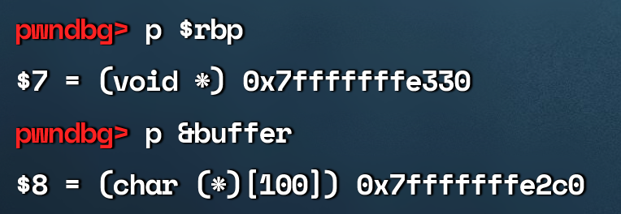
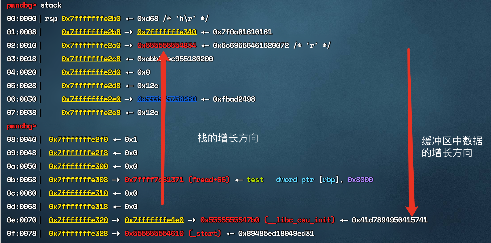

### gef

官方文档:https://hugsy.github.io/gef/

查看栈信息 

p/d 0x7fffffffe330 -  0x7fffffffe2c0 算距离

p 打印信息指令,默认用16禁止, p/d 采用十进制

不会看栈信息,遂换了pwndbg

打印一下rbp的地址和buffer地址,通过计算能得到相差12

可以看到,栈是从高地址往低地址增长的 ( 上面低地址,下面高地址),但是缓冲区还是从低地址向高地址生长,

高端地址中存在返回地址,上一个栈指针等重要信息,可能会被buffer的溢出所覆盖,

此处差一张图,(可参考 《计算机安全导论 深度实践》65页)

返回地址在112 + 8 = 120处

Python3 没有pip

编译安装pythonhttps://zhuanlan.zhihu.com/p/506491209

好多题是32位的,怎么在64位环境下编译成32 位的呢?

sudo apt-get install build-essential module-assistant 

sudo apt-get install gcc-multilib g++-multilib  

编译的时候需要加上参数

-m32

https://blog.csdn.net/ayang1986/article/details/105405592

## 挖坑

1.shellcode怎么编写

2.gdb和tmux联动

context.terminal = ['tmux', 'splitw', '-h']

