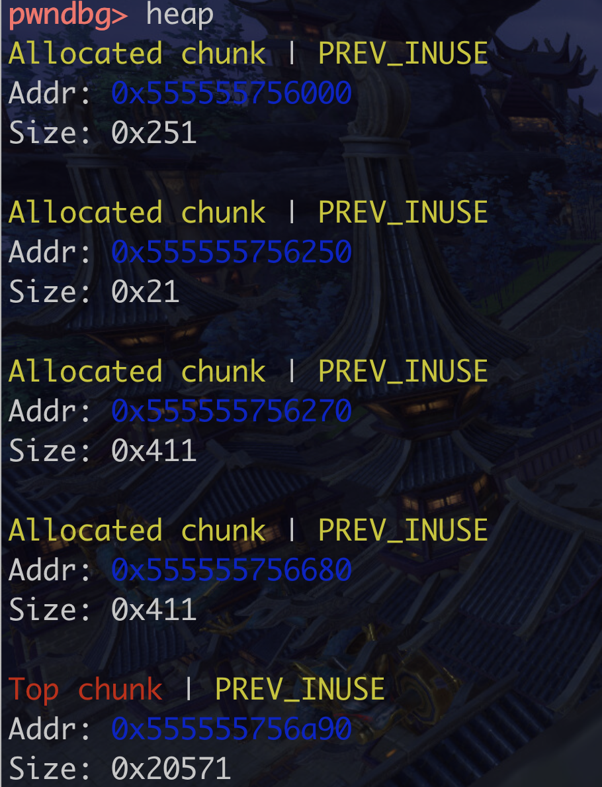
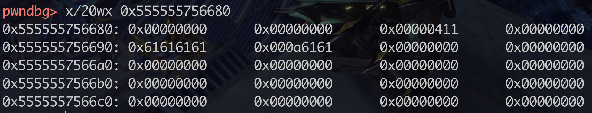
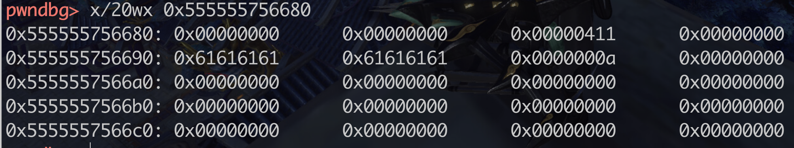

#### gdb pwndbg 调试堆

文档地址

https://browserpwndbg.readthedocs.io/en/docs/

```c
#include <stdio.h>

int main(void) 
{
  char *chunk;
  chunk=malloc(24);
  puts("Get input:");
  gets(chunk);
  return 0;
}
```


heap 查看堆的信息



然后就可以去地址里面查看具体的信息,不过为什么会分配那么多的堆块..

堆的话,从低地址向高地址生长,下面是输入6个a的情况,



7个a, 因为是小端序所以这样生长,不过这里面的a是啥,


不知道,8个a的时候就被挤到后面了,




