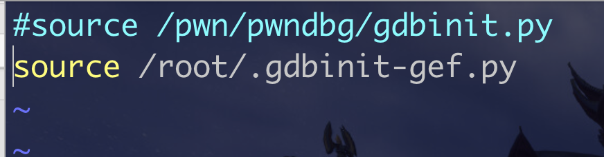

今天学了大半天..踩了无数坑,以后就用这种每天日记的形式,把学习到的东西记录下来吧,博客的话追求高质量的话不会那么快就能写出来,不如先简单记录,后期积淀够了再写

### 堆题目 libc版本问题

问题:在运行题目的时候发现并没有出现应该有的效果,漏洞被系统修补了

堆题目的话,利用的其实是libc堆管理机制的漏洞,而libc是不断发展的,有些之前的版本的漏洞现在已经失效了,所以在做堆题的时候要确定好堆的版本,然后进行切换,一台机器有默认的libc和ld,切换的换,需要用到个工具

patchelf和glibc-all-in-one

glibc-all-in-one的话是帮你收集到了各个版本的libc

patchelf是进行版本切换

#### glibc-all-in-one

sudo git clone https://github.com/matrix1001/glibc-all-in-one.git

cd glibc-all-in-one/

sudo python3 update_list

下载需要的libc版本

sudo ./download 2.34-0ubuntu3_amd64  #下载自己需要的版本

#### patchelf

git clone https://github.com/NixOS/patchelf.git  

cd patchelf

./bootstrap.sh 

./configure
make
make check
sudo make install

切换版本命令

patchelf --set-interpreter /root/glibc-all-in-one/libs/2.35-0ubuntu3_amd64/ld-linux-x86-64.so.2 ./bin    #bin为你想运行的elf文件  第一个参数是ld.so的目录 

patchelf --set-rpath  /root/glibc-all-in-one/libs/2.35-0ubuntu3_amd64/ ./bin

第一个参数是libc所在目录 bin你想运行的elf文件

这样的题目就可以正常运行了

### gef的使用

pwndbg不是pwn题的唯一选择,多掌握几个工具其实是很有帮助的,gef也非常好用,尤其是在某些方面比pwndb强的

具体信息可以看github仓库https://github.com/hugsy/gef

安装

~~~ bash
# via the install script
## using curl
$ bash -c "$(curl -fsSL https://gef.blah.cat/sh)"

## using wget
$ bash -c "$(wget https://gef.blah.cat/sh -O -)"

# or manually
$ wget -O ~/.gdbinit-gef.py -q https://gef.blah.cat/py
$ echo source ~/.gdbinit-gef.py >> ~/.gdbinit

# or alternatively from inside gdb directly
$ gdb -q
(gdb) pi import urllib.request as u, tempfile as t; g=t.NamedTemporaryFile(suffix='-gef.py'); open(g.name, 'wb+').write(u.urlopen('https://tinyurl.com/gef-main').read()); gdb.execute('source %s' % g.name)
~~~

#### gef与pwndbg的切换

vim ~/.gdbinit

需要用哪个,取消注释掉哪个即可

#### 踩坑

在用gef的时候一直提示一个编码问题

UnicodeEncodeError: 'latin-1' codec can't encode character '\u2596' in position 0: ordinal not in range(256)

网上也没有找到解决办法,但估计是python版本的问题,python3.6是有问题的,升级到3.9就可以了,升级链接见参考链接,但是不是唯一的方法(而且感觉有点麻烦其实..)

#### gef 在堆中的简单实用

gef的很多命令和gdb ,pwndbg差不多

r运行,s 断在开头

p main_arena.fasbinsY 查看fastbin的??

heap xxx 关于堆的命令

heap bins fast/small 查看bin的信息

### 参考链接

https://blog.csdn.net/weixin_49764009/article/details/124970461

http://t.zoukankan.com/xingzherufeng-p-9682660.html

https://blog.csdn.net/weixin_45556441/article/details/115536426

https://blog.csdn.net/weixin_45258310/article/details/120775357