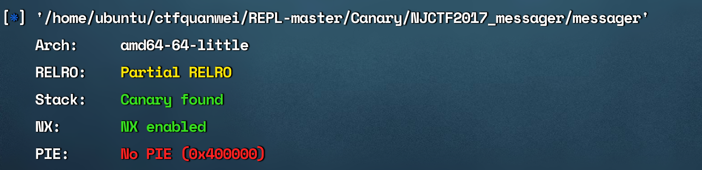

### njctf2017 messager




开了canary,要想办法绕过,然后开了nx,栈不可执行,要用rop之类的


反汇编函数挺长的

```c
__int64 __fastcall main(__int64 a1, char **a2, char **a3)
{
  int optval; // [rsp+0h] [rbp-10h] BYREF
  __pid_t v5; // [rsp+4h] [rbp-Ch]
  unsigned __int64 v6; // [rsp+8h] [rbp-8h]

  v6 = __readfsqword(0x28u);
  sub_400B76(a1, a2, a3);
  puts("[+]start..");
  addr.sa_family = 2;
  *(_WORD *)addr.sa_data = htons(0x15B3u);
  *(_DWORD *)&addr.sa_data[2] = htonl(0);
  len = 16;
  addr_len = 16;
  v5 = 0;
  puts("[+]socket..");
  dword_602140 = socket(2, 1, 0);
  if ( dword_602140 < 0 )
  {
    perror("socket");
    return 0xFFFFFFFFLL;
  }
  optval = 1;
  setsockopt(dword_602140, 1, 2, &optval, 4u);
  puts("[+]bind..");
  if ( bind(dword_602140, &addr, len) < 0 )
  {
    perror("bind error");
    return 0xFFFFFFFFLL;
  }
  puts("[+]listen..");
  if ( listen(dword_602140, 1024) < 0 )
  {
    perror("listen");
    return 0xFFFFFFFFLL;
  }
  while ( 1 )
  {
    fd = accept(dword_602140, &stru_602130, &addr_len);
    if ( fd == -1 )
    {
      perror("accept");
      return 0xFFFFFFFFLL;
    }
    send(fd, "Welcome!\n", 9uLL, 0);
    v5 = fork();
    if ( v5 == -1 )
    {
      perror("fork");
      return 0xFFFFFFFFLL;
    }
    if ( !v5 )
      break;
    close(fd);
  }
  signal(14, handler);
  alarm(3u);
  if ( (unsigned int)sub_400BE9() )
  {
    if ( send(fd, "Message receive failed\n", 0x19uLL, 0) == -1 )
      goto LABEL_14;
  }
  else if ( send(fd, "Message received!\n", 0x12uLL, 0) == -1 )
  {
LABEL_14:
    perror("send");
    return 0xFFFFFFFFLL;
  }
  return 0LL;
}
```


看不懂要怎么连接...先百度一波。应该要有端口的呀

socket(domain, type, protocol);


accept(fd, addr, addr_len);

listen(fd, n);

汇编代码里写哪了呢?


### sixstarts ctf 2018 babystack


###  [ret2libc3](https://github.com/ctf-wiki/ctf-challenges/raw/master/pwn/stackoverflow/ret2libc/ret2libc3/ret2libc3)

构造rop

先printf泄漏出libc基址,寻找到对应版本,然后构造system(‘/bin/sh’)

