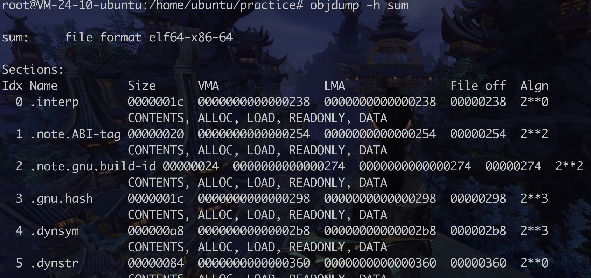
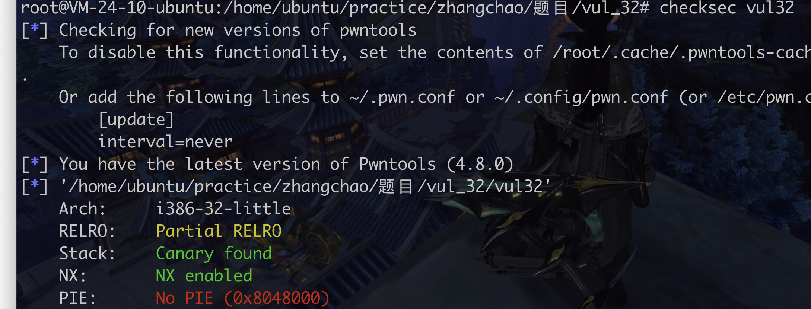

## 学习

Sum.c

```c
#include <stdio.h>

int sum(int x, int y)
{
        int t = x + y ;
        return t;
}

void main()
{
        int a = sum(1,2);
        printf("this number is:%d",a);
        return 0;
}
```


编译

gcc sum.c -o sum

### objdump

-h 查看section



-d 打印section汇编


### readelf

-h 查看elf头信息


-l 查看program header


### 几道题



NX,栈不可执行,canary,

如何绕过canary?

如何获得libc基址?


#### ret2libc


#### plt got的基础知识


