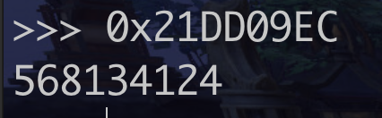
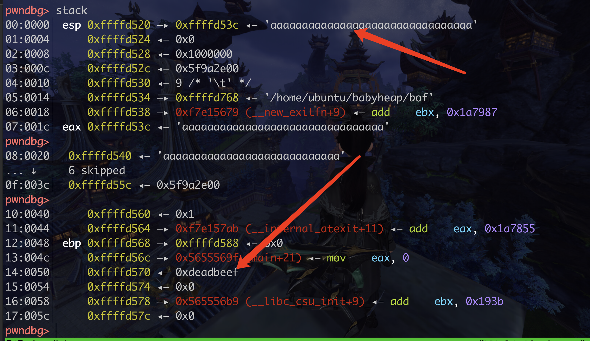
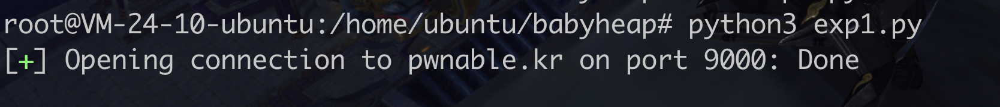

### 第一题:fd

Mommy! what is a file descriptor in Linux?

* try to play the wargame your self but if you are ABSOLUTE beginner, follow this tutorial link:
https://youtu.be/971eZhMHQQw

ssh fd@pwnable.kr -p2222 (pw:guest)


```c
#include <stdio.h>
#include <stdlib.h>
#include <string.h>
char buf[32];
int main(int argc, char* argv[], char* envp[]){
	if(argc<2){
		printf("pass argv[1] a number\n");
		return 0;
	}
	int fd = atoi( argv[1] ) - 0x1234;
	int len = 0;
	len = read(fd, buf, 32);
	if(!strcmp("LETMEWIN\n", buf)){
		printf("good job :)\n");
		system("/bin/cat flag");
		exit(0);
	}
	printf("learn about Linux file IO\n");
	return 0;

}
```

read 函数  int read(int handle,void *buf,int len);

int handle 为要读取的文件

​     void *buf 为要将读取的内容保存的缓冲区

​     int len  读取文件的长度


问题是这个fd是什么呢? 一个指针? 指向文件内容的

LETMEWIN 

标准输入标准输出!!

*linux中*有三种*标准输入输出*,*分别是STDIN,STDOUT,STDERR*,对应的数字是0,1,*2*。


为啥不搞个flag来....


### 第二题collision

Daddy told me about cool MD5 hash collision today.
I wanna do something like that too!

ssh col@pwnable.kr -p2222 (pw:guest)

```c
#include <stdio.h>
#include <string.h>
unsigned long hashcode = 0x21DD09EC;
unsigned long check_password(const char* p){
	int* ip = (int*)p;
	int i;
	int res=0;
	for(i=0; i<5; i++){
		res += ip[i];
	}
	return res;
}

int main(int argc, char* argv[]){
	if(argc<2){
		printf("usage : %s [passcode]\n", argv[0]);
		return 0;
	}
	if(strlen(argv[1]) != 20){
		printf("passcode length should be 20 bytes\n");
		return 0;
	}

	if(hashcode == check_password( argv[1] )){
		system("/bin/cat flag");
		return 0;
	}
	else
		printf("wrong passcode.\n");
	return 0;
}
```


int* int类型的指针 

要补一下c...


int* ip = (int*)p; 

这玩意到底是啥




### 第三题 bof  开始溢出了

```c
#include <stdio.h>
#include <string.h>
#include <stdlib.h>
void func(int key){
	char overflowme[32];
	printf("overflow me : ");
	gets(overflowme);	// smash me!
	if(key == 0xcafebabe){
		system("/bin/sh");
	}
	else{
		printf("Nah..\n");
	}
}
int main(int argc, char* argv[]){
	func(0xdeadbeef);
	return 0;
}

```

先把32字节覆盖了,然后是什么捏,然后是key吗?




0x50个字节呀

为什么接收不到会卡住呢???




好像是和标准输入什么有关

https://blog.csdn.net/mcl2840072208/article/details/93135996


要覆盖的buf应该是eax这里,看esp这里,也指向这里,所以说buf是从这里开始

0xffffd570 - 0xffffd53c = 52 

为啥不能直接用buf + 来算呢????????????????????????????

不能简单的来概述??? 可能会有其他东西? 而且还要看汇编,它是怎么来索引的???


0x2c + 8 = 52

44  + 8 = 52

感觉除了buf还有 其他东西。 Var_2c 占了32 , 它就是buf。 Var_c占了12,它是什么呢?????????

12是啥,字节吗??? 所以它是不是要比较的 0xcafebabe


0x3c + 0x20 = 0x5c

0xffffd55c ◂— 0x61d1b000

​	if(key == 0xcafebabe){ 


好,我们来尝试一下sendline的问题!

sendlineafter就不行...为啥???????????????????????????//

io.recv() 也不行

https://www.cnpython.com/qa/1303538

