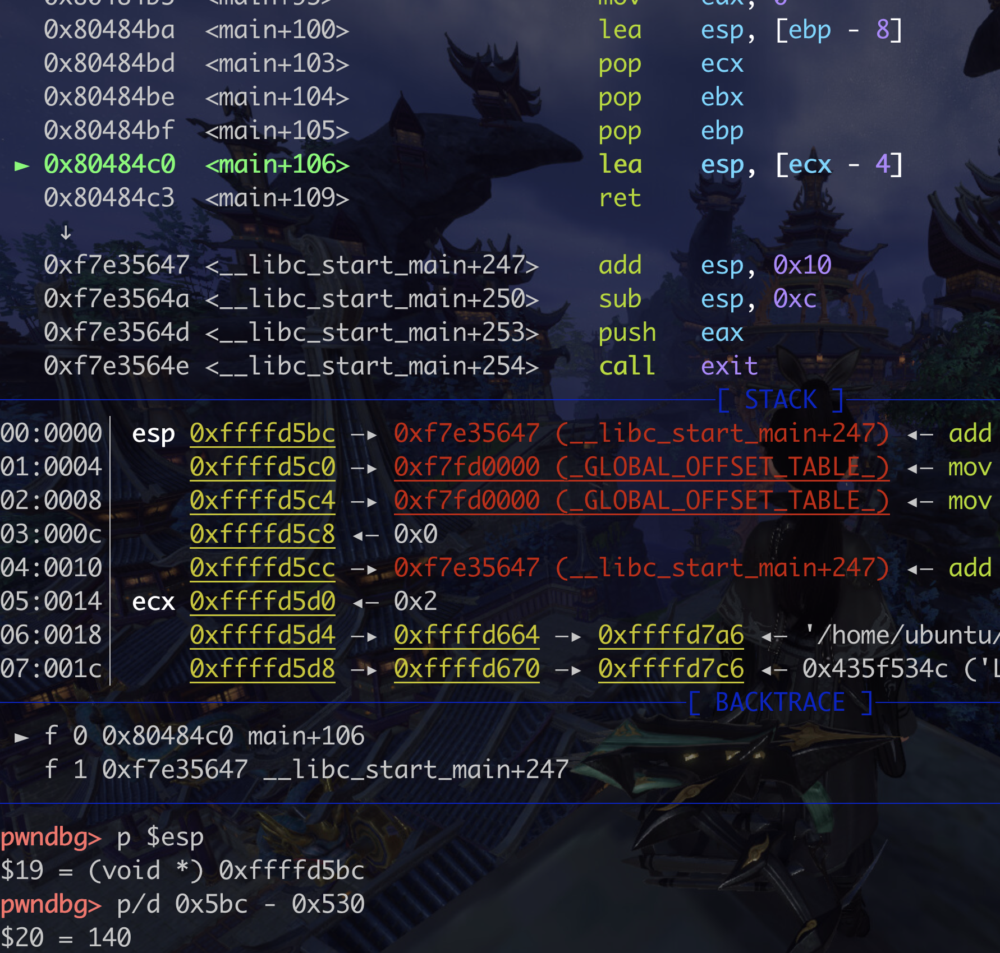

先捋一捋结构吧,这个月的第一篇博客

我觉得还可以以题目为引导,在做题和写题解的时候遇到的问题就可以都写到博客里,不然一开始直接想有时候想不到那么全面

问题导向型博客可以


### 栈溢出的基础及例子

栈溢出会造成什么样的破坏?

如何进行破坏?

ret2 系列 rop


#### ret2shellcode

```c
#include <stdio.h>
#include <string.h>

int main(int argc, char **argv)
{
	char buf[128];
	if ( argc < 2 ) return 1;
	strcpy(buf, argv[1]);
	printf("argv[1]:%s\n",buf);
	return 0;
}
```

gcc -z execstack -fno-stack-protector  -no-pie bof.c -o bof -m32

有参数的话,在gdb中。start xxx(第一个参数) 这样调试即可

关掉PIE:

sudo cat /proc/sys/kernel/randomize_va_space

0：关闭
1：随机化栈基地址（stack）、共享库（.so\libraries）、mmap 基地址
2：在1基础上，增加随机化堆基地址（chunk）

要算缓冲区地址的话,要下断点到这里才可以的

不知道为什么会有这么一句..在ret前..可能和编译器有关我觉得




找缓冲区buf长度好麻烦..........感觉越来越晕了...........先做几道题然后找一下试试吧


#### ret2text/ret2backdoor


### 推荐资料


ROP的提出: the geometry of innocent flesh on the bone:return-into-libc without Function Calls

return- oriented programming without returna


jmp指令攻击手法: jump-oriented programming: a new class of code-reuse attack


