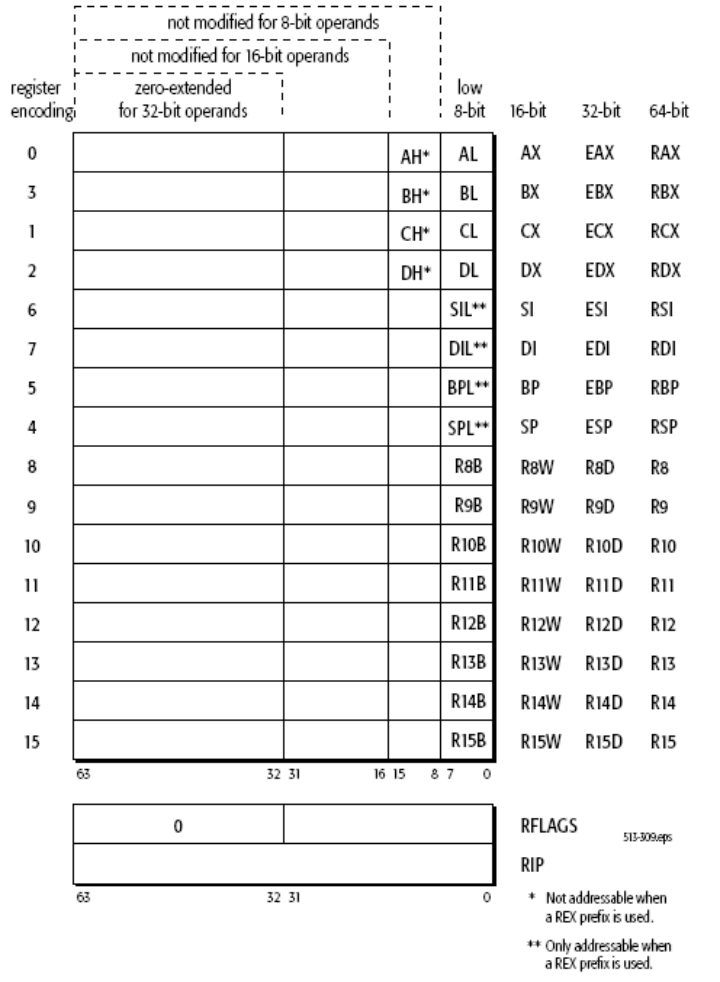

### 栈的基础

#### 32位 / 64位 架构的不同

32位和64位,在寄存器,调用约定等方面存在不同,攻击手法也会有所差异,当然原理是差不多的.

##### 寄存器的区别

通用寄存器:

RAX RBX RCX RDX RSI RDI R8-R15

特殊寄存器:

​	栈指针寄存器 RSP RBP : 指向 栈顶 和 栈低
​	段寄存器 CS SS FS GS ES DS 
​	指令计数器 RIP: 存放下一条将要执行的指令的地址
​	标志寄存器 RFlags

寄存器可以部分使用:

例：64bit RAX

低32bit EAX
低16bit AX
低8bit   AL
8-16bit AH

R8-R15 使用32bit时称为RxxD，使用16bit时称为RxxW，使用8bit时称为RxxB

#### 调用约定( Calling conventions) 

规定了函数的参数传递方式、栈清理方式等

种类:

c调用约定 __cdecl : 调用方按从右到左的顺序将函数参数放入栈中，在被调用的函数完成其操作时，调用方（而不是被调用方）负责从栈中清除参数。

标准调用约定 (微软给自己起的标准) __stdcall:  用约定按从右到左的顺序将函数参数放在程序栈上,被调用方清理栈

x86的fastcall约定(stdcall的一个变体) __fastcall:

c++ 调用约定 __thiscall:

换一种分类方法(列举常见的调用约定):

​	32位 C语言

​	__cdecl: 参数从右向左压栈，调用者清理栈，返回值在EAX中

​	__stdcall:参数从右向左压栈，被调用者清理栈，返回值在EAX中

​	__fastcall: 前两个参数在ECX EDX中，剩下的参数压栈

​	__thiscall: ECX中存放this指针，剩下的参数压栈

​	64位 C语言

​	Microsoft x64 调用约定（Windows）： RCX RDX R8 R9

​	System V x64 调用约定 （Linux，MacOS）： RDI RSI RDX RCX R8 R9

(参考白泽的公开课,可在知乎账号查看

《ida pro权威指南 第二版》

所以在做32位和64位题的时候,要构造参数时的步骤是不一样的,比如32位一般采用__cdecl调用约定,从栈传参,不需要额外的gadget,64位的话就需要pop ret来设置寄存器再进行传参

栈是一种怎样的结构,它用来干什么,为什么会有

libc版本问题

### 危险函数

什么东西放在栈里呢?

找溢出长度

栈对齐

​	https://www.cnblogs.com/ZIKH26/articles/15996874.html

#### 延迟绑定

