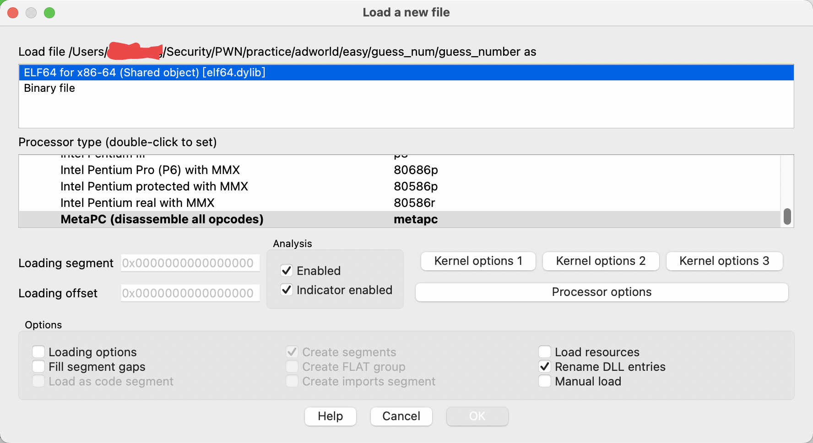
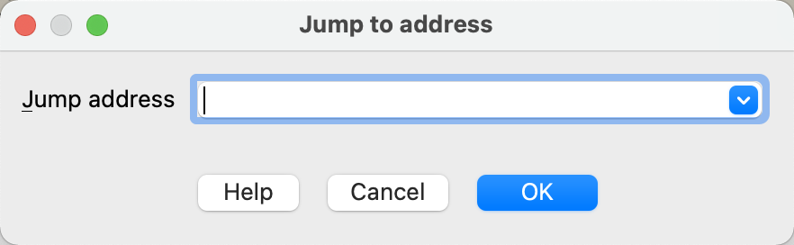

# IDA

[https://blog.csdn.net/m0_43406494/article/details/109110983](https://blog.csdn.net/m0_43406494/article/details/109110983)

默认的图形视图和面向文本的列表 视图，使用快捷键“空格”可以进行切换

ctrl+鼠标滚轮或者+- 对页面进行缩放

函数的控制流图，由许多个基本块构成。基本块之间用不同颜色 的箭头连接，

蓝色箭头表示执行下一个基本块，

红色箭头表示跳 转到判断条件为假的分支，

绿色箭头表示跳转到判断条件为真的分 支。

交叉引用 : 快捷键X 可以快速找到一个函数被调用的地方或者一个数据被使用的地方

文本界面反汇编:黑色代表代码,灰色是数据,未定义数据类型黄色

## 快捷键:

### 数据操作:

shift + f12 显示字符串string

D – 设置数据 (Data)  1字节 2字节 4字节 8字节 进行循环
C – 设置代码 (Code) 设置为指令
A – 设置ASCII字符串 (ASCII)
* - 设置数组
O – 设置地址偏移 (Offset)
U – 取消定义 (Undefine)
X – 交叉引用查找 (Cross-reference, Xref)

将数据叠在一起

### 函数操作

P – 创建函数
Del – 删除函数
Ctrl+E – 修改函数(函数窗口)

Alt+P 修改函数(反汇编窗口)

### 伪代码操作

N – 修改标识符名称 (Name)
Y – 修改标识符类型 (tYpe)
数据显示格式切换

### 搜索

alt+t查找字符串

G跳转指定地址

