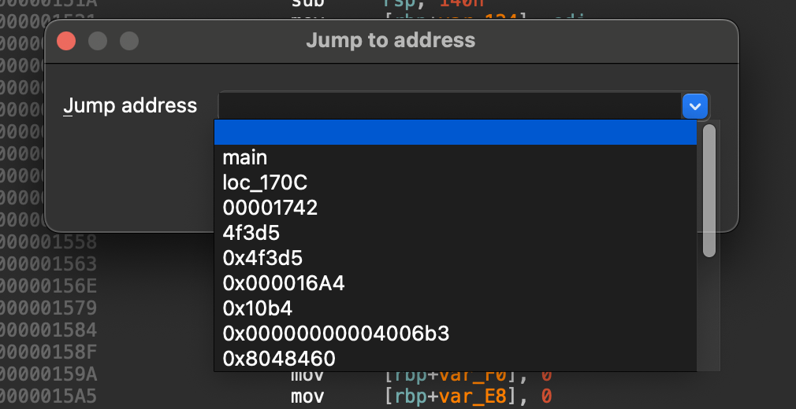
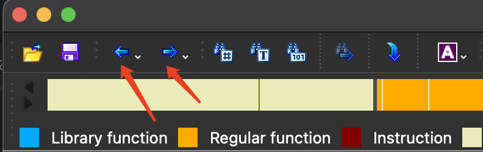

《idapro权威指南第二版》

跳转到已知反汇编地址: jump to address。快捷键:g ( 输入函数名称或16进制的值)

并且会记住历史搜索,方便返回

前进、 后退: ctrl+enter、 esc

或者工具栏上面的这个

### 调用约定

## 第七章 反汇编操作

#### 名称与命名

重命名:n

#### 注释:

常规注释: 汇编代码  快捷键 ctrl+ :

IDA 本身就大量使用常规注释。在分析阶段，IDA 插入常规注释说明为调用函数而压入的参数。只有当IDA 拥有被调用函数的参数名称或类型信息时，它才会使用常规注释。通常，这些信息包含在类型库中（这些内容将在第8章和第13 章讨论），也可以手动输入

可重复注释: ctrl + ;

在前注释 在后注释: 

函数注释:

#### 基本代码转换

IDA 提供的代码转换包括以下几类：

将数据转换为代码；

将代码转换为数据；

指定一个指令序列为函数；

更改现有函数的起始或结束地址；

更改指令操作数的显示格式。

新建函数、删除函数

#### 基本数据转换

